#  Populations with Limited Access to Mental Health Care | Analysis of health professional shortage areas in the United States

# Table of Contents

* [Background](#background)
* [Problem Statement](#problem-statement)
* [Data Collection](#data-collection)
* [Data Cleaning](#data-cleaning)
* [Exploratory Data Analysis](#exploratory-data-analysis)
* [Data Analysis Summary](#data-analysis-summary)
* [Modeling Steps and Results](#modeling-steps-and-results)
* [Conclusions and Next Steps](#conclusions-and-next-steps)
* [Resources](#resources)

---

# Background
Millions of American have a mental health condition and seek professional help every year. For some communities in the U.S., access to mental health care is not always available. Although people in vulnerable situations are more likely to struggle with a mental health condition, they experience more barriers to receive the medical help they need. 

The Health Resources and Services Administration (HRSA) is an agency dedicated to address the gap of access to medical services for underserved populations.

This agency identifies geographic areas, populations, and facilities that have a shortage of healthcare personnel in the areas of primary care, dentistry, and mental health. These are referenced as HPSA, Health Professional Shortage Areas and they are eligible to receive federal assistance.

---

# Problem Statement
The goal of this project is to explore the data available for HPSAs and identify trends and key factors that can be useful for future programs and policies to address the need of the population.

---

# Data Collection
## Datasets Used:
- HPSAs from 1973 to 2020 for the US and territories. Source: Health Resources and Administration. 
- Total Covid cases from Jan 19 to Dec 01, 2020. Source:  USA Facts website.
- Data for total populations in the US. Source: US Census Bureau 

---

## Data Dictionary

|Feature|Type|Dataset|Description|
|---|---|---|---|
|HPSA Name|object|HPSA – Mental Health|The name of the Health Professional Shortage Area (HPSA). |
|Designation Type|object|HPSA – Mental Health|Textual description of the Health Professional Shortage Area (HPSA) type.|
|HPSA Score|int |HPSA – Mental Health|Health Professional Shortage Area (HPSA) Score developed by the National Health Service Corps (NHSC) in determining priorities for assignment of clinicians. The scores range from 0 to 26 where the higher the score, the greater the priority.|
|Primary State Abbreviation|object|HPSA – Mental Health|State or territory name.|  
|HPSA Status|object|HPSA – Mental Health|Textual description of the current status of the Health Professional Shortage Area (HPSA) designation.|
|HPSA Designation Date|object|HPSA – Mental Health|Date on which the Health Professional Shortage Area (HPSA) was originally designated as a shortage area.|
|HPSA Designation Last Update Date|object|HPSA – Mental Health|Date on which the Health Professional Shortage Area (HPSA) information was last updated in the source system.|
|Metropolitan Indicator|object|HPSA – Mental Health|Description indicating whether a Health Professional Shortage Area (HPSA) is either Metropolitan, Non-Metropolitan, or Frontier in nature.|
|HPSA Geography Identification Number|object|HPSA – Mental Health|Health Professional Shortage Area (HPSA) geography code which identifies the specific geographic area (county, minor civil division (MCD), or Census Tract) associated with the HPSA.|
|HPSA Degree of Shortage|int|HPSA – Mental Health|This is the number of HPSA – Mental Health test takers|
|Withdrawn Date|object|HPSA – Mental Health|Average HPSA – Mental Health  Reading Score, an asterisk is displayed  for schools with 14 or fewer students taking the HPSA – Mental Health in order to preserve the anonymity of the students. An N/A is displayed if there were no HPSA – Mental Health test takers and the grade 12 enrollment is equal to or greater than 15|
|HPSA FTE|int|HPSA – Mental Health|Average HPSA – Mental Health  English Score, an asterisk is displayed  for schools with 14 or fewer students taking the HPSA – Mental Health in order to preserve the anonymity of the students. An N/A is displayed if there were no HPSA – Mental Health test takers and the grade 12 enrollment is equal to or greater than 15|
|HPSA Designation Population|int|HPSA – Mental Health|Average HPSA – Mental Health Science Score, an asterisk is displayed  for schools with 14 or fewer students taking the HPSA – Mental Health in order to preserve the anonymity of the students. An N/A is displayed if there were no HPSA – Mental Health test takers and the grade 12 enrollment is equal to or greater than 15|
|% of Population Below 100% Poverty|int|HPSA – Mental Health|Average HPSA – Mental Health Math Score, an asterisk is displayed  for schools with 14 or fewer students taking the HPSA – Mental Health in order to preserve the anonymity of the students. An N/A is displayed if there were no HPSA – Mental Health test takers and the grade 12 enrollment is equal to or greater than 15|
|HPSA Formal Ratio|int|HPSA – Mental Health|Number of Test Takers Whose HPSA – Mental Health Composite Scores Are Greater or Equal to 21. An asterisk is displayed for schools with 14 or fewer students taking the HPSA – Mental Health in order to preserve the anonymity of the students. An N/A is displayed if there were no HPSA – Mental Health test takers and the grade 12 enrollment is equal to or greater than 15|
|Primary HHS Region Name|float|HPSA – Mental Health|Percent of Test Takers Whose HPSA – Mental Health Composite Scores Are Greater or Equal to 21.An asterisk is displayed for schools with 14 or fewer students taking the HPSA – Mental Health in order to preserve the anonymity of the students. An N/A is displayed if there were no HPSA – Mental Health test takers and the grade 12 enrollment is equal to or greater than 15.|
|Longitude|object|HPSA – Mental Health|Primary longitude in decimal degrees (x coordinate) of an entity based on its address.|
|Latitude|object|HPSA – Mental Health|Primary latitude in decimal degrees (y coordinate) of an entity based on its address.|
|Common County Name|object|HPSA – Mental Health|Name of the county or county equivalent in which the associated address is located, displayed as a text string.|
|County Equivalent Name|object|HPSA – Mental Health|County Name|
|HPSA Designation Population Type Description|int|HPSA – Mental Health|This attribute represents Health Professional Shortage Area (HPSA) designation population type description.|
|HPSA Estimated Served Population|int|HPSA – Mental Health|Estimated total population served by the full-time equivalent (FTE) Health care practitioners within a Health Professional Shortage Area (HPSA).|
|HPSA Estimated Underserved Population|object|HPSA – Mental Health|Estimated underserved population served by the full-time equivalent (FTE) health care practitioners within a Health Professional Shortage Area (HPSA).|
|HPSA Provider Ratio Goal|object|HPSA – Mental Health|Health Professional Shortage Area (HPSA) Provider Ratio Goal that is the target population per provider (physician) for the HPSA in a Discipline Class. Federal regulations stipulate that, in order to be considered as having a shortage of providers, an area must have a population-to-provider ratio of a certain threshold. For primary medical care, the population to provider ratio must be at least 3,500 to 1 (3,000 to 1 if there are unusually high needs in the community). For dental, the ratio must be at least 5,000 to 1 (4,000 to 1 in high-need communities). For mental health, the area must have a population to psychiatrist ratio of 30,000 to 1 (20,000 to 1 in high-need communities).|
|HPSA Shortage|object|HPSA – Mental Health|Number of full-time equivalent (FTE) practitioners needed in the Health Professional Shortage Area (HPSA) so that it will achieve the population to practitioner target ratio.|
|U.S. - Mexico Border County Indicator|object|HPSA – Mental Health|Indication of whether a county or a part of a county is listed in U.S. counties that the U.S. - Mexico Border Health Commission has defined as comprising the Border Health Initiative zone.|

---

# Data Cleaning
- Removed columns in dataset without significant information. Addressed null values.
- Data scope 1978-2020
- Combined HPSA data for multiple census tracts.
- For covid data, broke down data by county. Calculated new covid cases by county and day.

---

# Exploratory Data Analysis
- Used Python libraries for visualizations.
- Identified trends in states and counties. 
- Trends over time.
- Impact due to Covid-19
- Trends by type of shortage area

---

# Data Analysis Summary

The number of HPSAs over the years is plotted below. The number of HPSAs has been increasing and it had a spike in 2019.
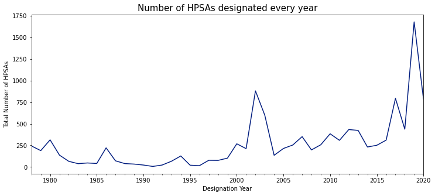

The number of HPSAs designated vs withdrawn is shown below. The number of areas withdrawn from the HPSA list is lower than the number of designations for almost every year.

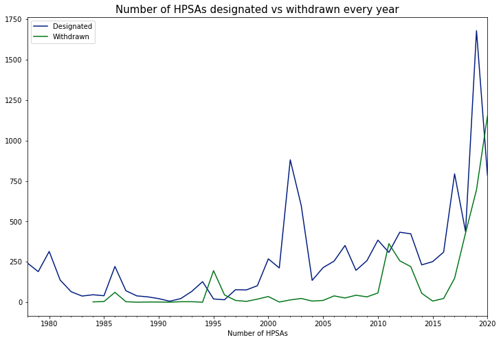

The Health Professional Shortage Area (HPSA) Score is assigned to determine priorities for assignment of clinicians. The scores range from 0 to 26 where the higher the score, the greater the priority.

All HPSA types have approximately the same mean ~ 17. More variation in scores for Facility and Geographic types.
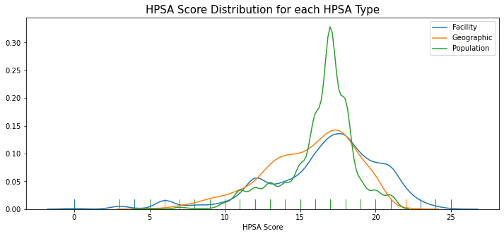

Most facilities designated as HPSA are in Rural Areas

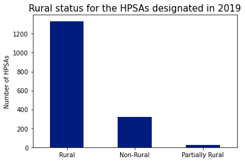

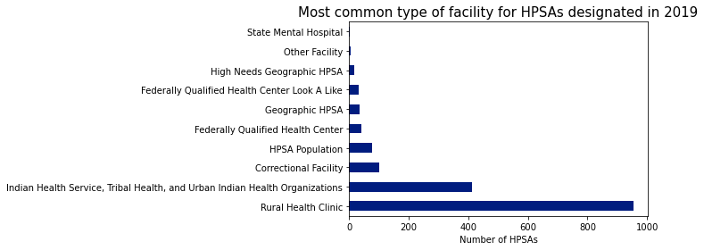

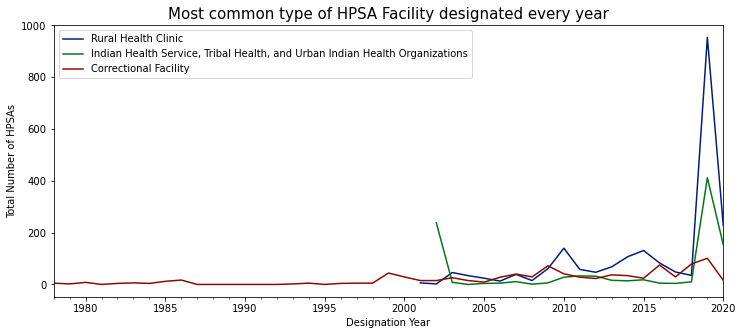

The number of HPSAs in counties near the Mexico border is relatively small but it has been increasing with two spikes in the last 4 years

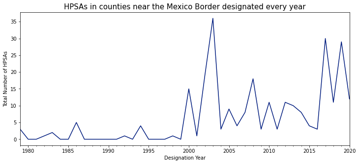

States with the most number of shortage areas:
California, Texas, Alaska, Missouri, Michigan

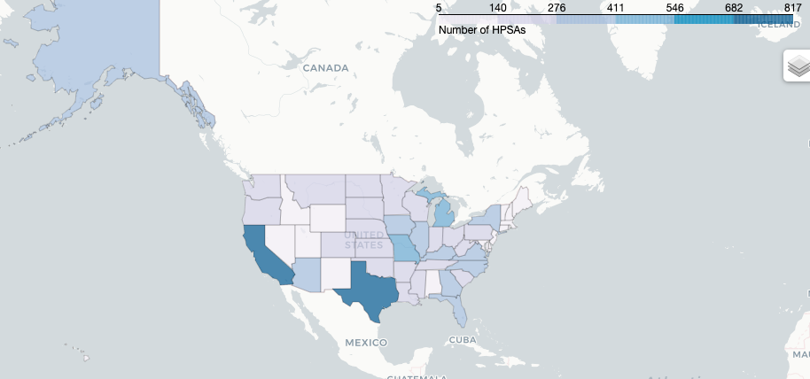

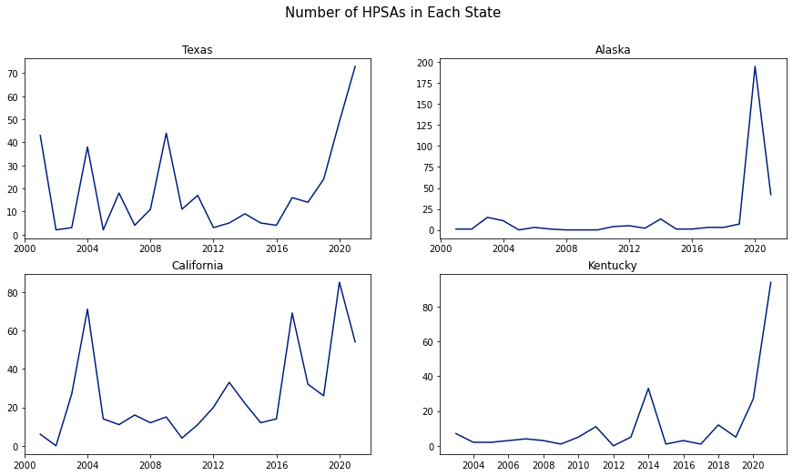

Trends of HPSA Facility Designations over Time

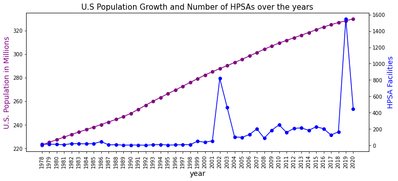

Increases in the number of designated underserved populations increased this year in areas severely hit by the pandemic.  

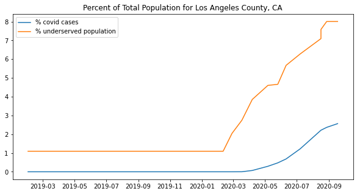

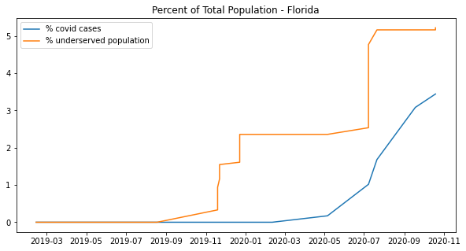

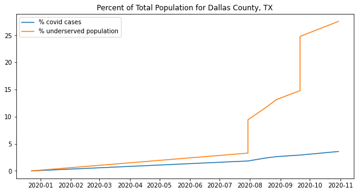

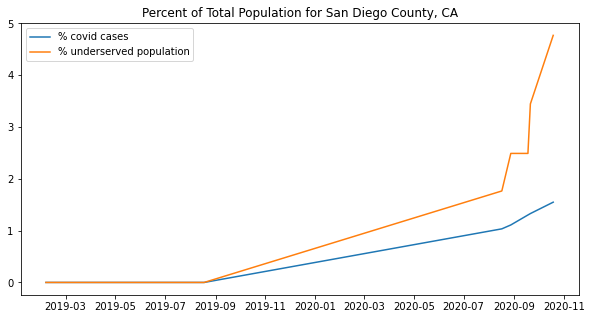

People living below the poverty level were nearly 2.5 times more likely to have depression than those at or above the poverty level./

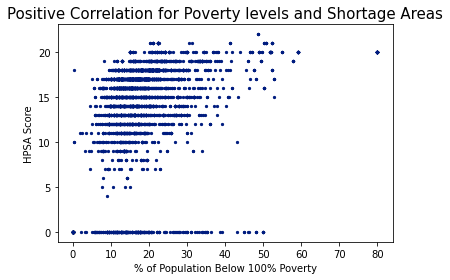

---

# Modeling Steps and Results

- Target: Predict if an HPSA remains Designated or it is Withdrawn
- Baseline is 65% - the majority class(Designated)
- Used the data collected and cleaned to build and train multiple models in Python.
- Logistic Regression, Adaboost, and Random Forest classification models were built and optimized using GridSearch to find the best hyperparameters.
- Five models were built for each type of model, and the test data performance and variability was evaluated using cross-validation.
- Confusion matrices were calculated for each model and the metrics compared.

| Model | Accuracy | Sensitivity | Specificity | Precision
|---|---|---|---|---|
|Logistic Regression|0.79|0.53|0.92|0.76|
|Adaboost|0.80|0.50|0.94|0.80|
|Random Forest|0.83|0.72|0.89|0.76|

The Random Forest classification model was selected. This model had 83% accuracy to predict if an HPSA would be withdrawn from its designation or not. 

---

# Conclusions and Next Steps
- A Random Forest classification model with an accuracy of 83% was built to predict if a HPSA would be removed from the designated list.
- This analysis is exploratory. It is important to understand the needs of psychiatrically underserved populations and the information for all states.
- Provide information about trends to programs that can address the gap to medical care such us: reviewing of hospital and state licensing requirements for psychiatrists. telepsychiatry and improvements in training of the mental health workforce

---

# Resources
- Health Resources and Services Administration, https://nhsc.hrsa.gov/about-us
- “Doctors facing burnout could see job repercussions for seeking antidepressants”, Dr. Yalda Safai. December 10, 2020, https://abcnews.go.com/Health
- “Challenges and Opportunities to Meet the Mental Health Needs of Underserved and Disenfranchised Populations in the United States”, Francesca Mongelli, M.D., Penelope Georgakopoulos, Dr.P.H., Michele T. Pato, M.D. Published Online:24 Jan 2020 https://doi.org/10.1176/appi.focus.20190028
- “For people in underserved communities, getting mental health care is a struggle”. https://blackbearrehab.com/blog/for-people-in-underserved-communities-getting-mental-health-care-is-a-struggle/
- Centers for Disease Control and Prevention, https://www.cdc.gov/nchs/fastats/mental-health.htm
National Alliance of Mental Illness, https://www.nami.org/getattachment/Get-Involved/NAMI-National-Convention/Convention-Program-Schedule/Hill-Day-2017/FINAL-Hill-Day-17-Leave-Behind-all-(1).pdf
- U.S Population by Year, https://www.multpl.com/united-states-population/table/by-year

